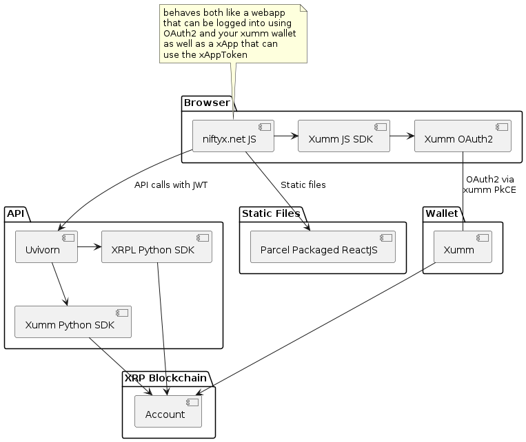

# niftyx-poc
A proof of concept for a xumm app demonstrating the concept of "Hybrid xApps" which are xApps that have three authentication modes:

* xApp - xumm apps are authenticated by the using the application inside the xumm mobile app and the xumm API via the xAuthToken generated by the xumm app.
* Browser OAuth2 - xApps can also be authenticated by the user via a browser based OAuth2 flow. This is the most common way to authenticate a web app.
* Server Side JWT Backend - Both modes produce a JWT, this JWT can be used to protect backend calls.

## Architecture

The project includes all implementations required to run a xumm app, a browser based OAuth2 flow and a server side JWT backend. The project is a simple FastAPI app that can be run locally or deployed to a server. The app is a simple stub that can be used to build any new xapp, as a ReactJS app that can be built and deployed to a server or as a static site.



## xApp

## Browser OAuth2

## Server Side JWT Backend

[verification of xumm JWT](https://github.com/claytantor/niftyx-poc/blob/main/api/decorators.py#L16)

```python
@staticmethod
def verify_jwt(jwt_token, jwks=None, kid="default"):

    if jwks is None:
        raise ValueError("jwks is required")

    jwt_body = jwt.decode(jwt_token, options={"verify_signature": False})

    public_keys = {}
    for jwk in jwks['keys']:
        kid = jwk['kid']
        public_keys[kid] = 
        jwt.algorithms.RSAAlgorithm.from_jwk(
            json.dumps(jwk))
        
    key = public_keys[kid]
    logger.info(f"=== kid {kid} {public_keys} {key}")
    payload = jwt.decode(jwt_token, key, 
        algorithms=['RS256'], audience=jwt_body['aud'],
        issuer='https://oauth2.xumm.app')
    
    logger.info(f"=== payload {payload} VERIFIED")

```

this method gets called on incoming requests to the backend API

```python
@router.get("/account/info")
@verify_xumm_jwt
async def get_account_info(request: Request,  token: str = Depends(oauth2_scheme)):
    
    jwt_body = get_token_body(token)

    xrp_network = get_xrp_network_from_jwt(jwt_body)
    client = xrpl.clients.JsonRpcClient(xrp_network.json_rpc)

    acct_info = AccountInfo(
        account=jwt_body['sub'],
        ledger_index="current",
        queue=True,
        strict=True,
    )

    response = await client.request_impl(acct_info)
    return response.to_dict()
```

## Setup

### running the web app

```bash
cd webapp
npm install
npm run build
npm run serve-local
```

### running the uvicorn server

You need to have a `.env` file in the root of the project with the following contents:

```bash
API_VERSION=0.1.1
XUMM_API_KEY="<your_info>"
XUMM_API_SECRET="<your_info>"
NIFTYX_ADDRESS="rrnR8qAP8t..."
BANANA_API_KEY="<your_info>"
BANANA_MODEL_KEY="<your_info>"
AWS_BUCKET_NAME="my-bucket-name"
AWS_UPLOADED_IMAGES_PATH="uploaded_images"
AWS_ACCESS_KEY_ID="<your_info>"
AWS_SECRET_ACCESS_KEY="<your_info>"
AWS_REGION="us-west-2"
PINATA_API_KEY="<your_info>"
PINATA_SECRET_KEY="<your_info>"
PINATA_PINNING_ENDPOINT="https://api.pinata.cloud/pinning/pinJSONToIPFS"
PINATA_OUTDIR="/home/mydir/data/out"
XAPP_PREFIX="http://localhost:3010/xapp"
```
and then start the uvicorn server

```bash
#!/bin/bash
# Usage: runapi.sh <env>
APP_CONFIG=env/$1/api.env python -m api
```


